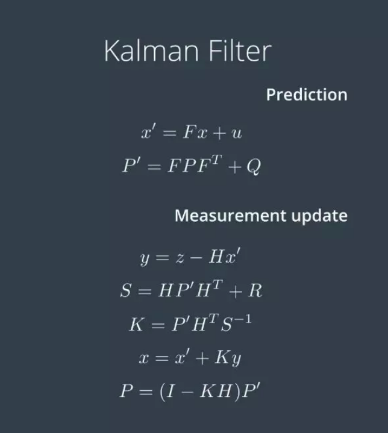

g++ main.cpp -I /usr/include/eigen3/

[讲解](https://mp.weixin.qq.com/s?__biz=MzI1NjkxOTMyNQ==&mid=2247486367&idx=1&sn=809b181e9cb54d3f268e065fe31b8071&chksm=ea1e19eddd6990fba657edbcc7545aa1119b7043c046af830f19046f64ae0ce4e162a5d3129c&mpshare=1&scene=2&srcid=0212fC6ckNDqv3mUzSCi7cfw&from=timeline&pass_ticket=ZirqGBsQWpyaveKysV9SVikDoUYg30tD6SJ%2FfnaBHcLp4y1eIGEF8jH8CbrpWKWj#rd)